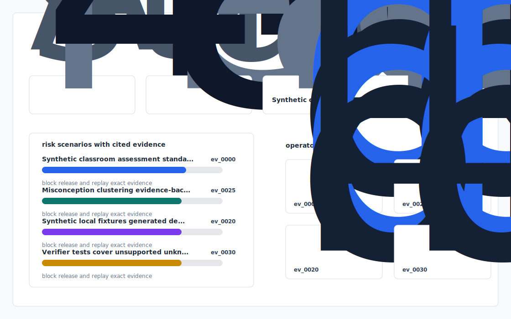
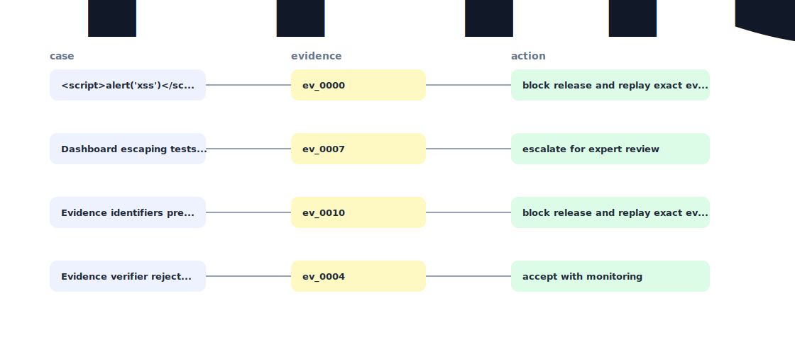

# Misconception Intervention Engine


A local education analytics prototype that maps synthetic learner signals to standards-aligned misconceptions and intervention recommendations.

`misconception-compass` favors explicit fixtures, deterministic checks, and reviewable artifacts over hidden services or live data.

## Context

Misconception-to-Intervention Engine for Standards-Aligned Classrooms.

## Scoring model

- Synthetic classroom, assessment, standard, and intervention records.
- Misconception clustering with evidence-backed intervention ranking.
- Static dashboard and verifier for explainable instructional recommendations.

## Execution

```bash
uv sync
uv run app init-demo
uv run app ingest fixtures/
uv run app analyze
uv run app verify
uv run app dashboard
uv run app benchmark
uv run app export-demo-pack
uv run pytest -q
uv run ruff check .
```

## Audit trail

- `outputs/dashboard.html`
- `outputs/decision_report.md`
- `outputs/evidence_graph.mmd`
- `outputs/risk_or_quality_report.csv`
- `outputs/benchmark.md`
- `outputs/demo_pack.md`

## Validation commands

```bash
uv run ruff check .
uv run pytest -q
uv run app verify
```

## Synthetic data

The `misconception-compass` public surface is source, tests, lockfile, and docs. It does not need credentials, browser state, customer records, or hosted services.


